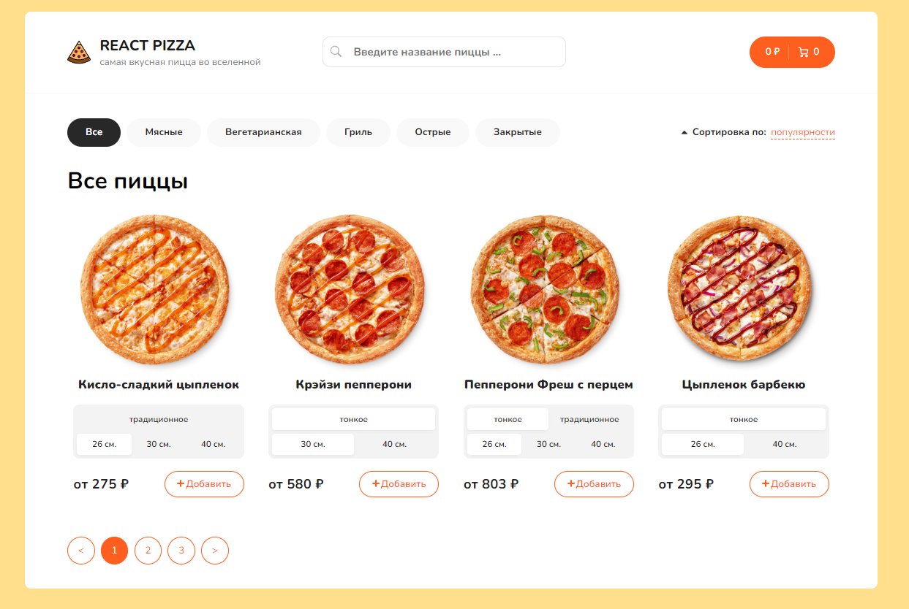
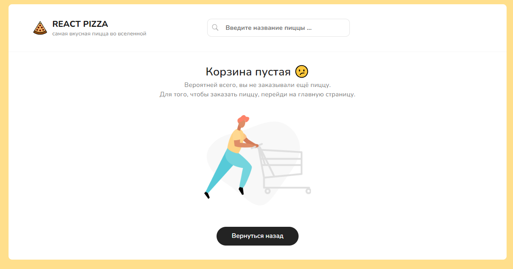
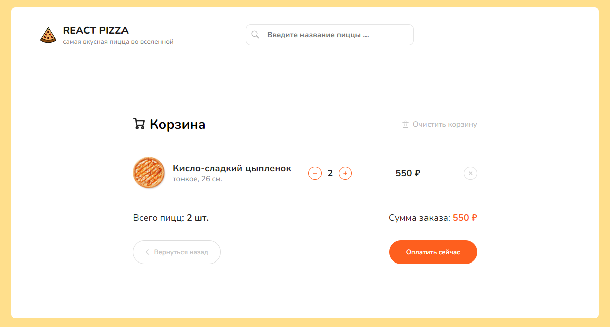

# React Pizza

React Pizza is an online pizza shop. Mockapi.io was used as a backend. The following functions are implemented in the project: adding pizza to the cart, removing it from the cart, increasing and decreasing the number of pizzas in the cart, and many more functions.

## Technologies

- ReactJS
- React-Paginate
- Lodash.debounce
- SCSS
- TypeScript
- Redux-Toolkit
- Axios

## Development

### Requirements

To install and run the project, you need NodeJS v18+ and Git.

### Installing dependencies

To install dependencies, run the command:
`yarn install`

### Run Development Server

To run development server, run the command:
`yarn start`

### Production build

To run a production build, run the command:
`yarn build`

## FAQ

### Why did you develop this project?

I wanted to improve my knowledge of ReactJS and TypeScript into practice.

## About the developer

- Usmanov Abdurakhman - Frontend developer
- Contact me
  - Email: ausmanov706@gmail.com
  - Telegram: [Abdurakhman Usmanov](https://t.me/Ausm2002)

## Interface Screenshots

